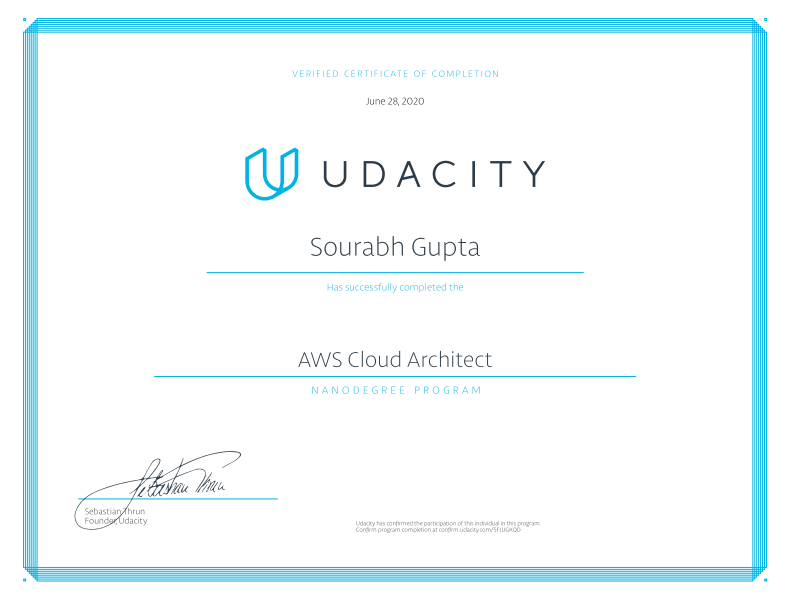

# Udacity AWS Cloud Architect Nanodegree

This repository contains notes from Udacity AWS Cloud Architect Nanodegree program.

## Nanodegree Certificate

[Graduation Confirmation](https://confirm.udacity.com/5FJUGKQD)

  

## Project Solutions

-   [Recoverability in AWS Solution](https://github.com/sourabhgupta385/udacity-project-recoverability-in-aws)
-   [Design, Provision and Monitor AWS Infrastructure at Scale Solution](https://github.com/sourabhgupta385/udacity-project-design-for-performance-and-scalability)
-   [Secure the Recipe Vault Web Application Solution](https://github.com/sourabhgupta385/udacity-project-securing-recipe-vault-web-app)
